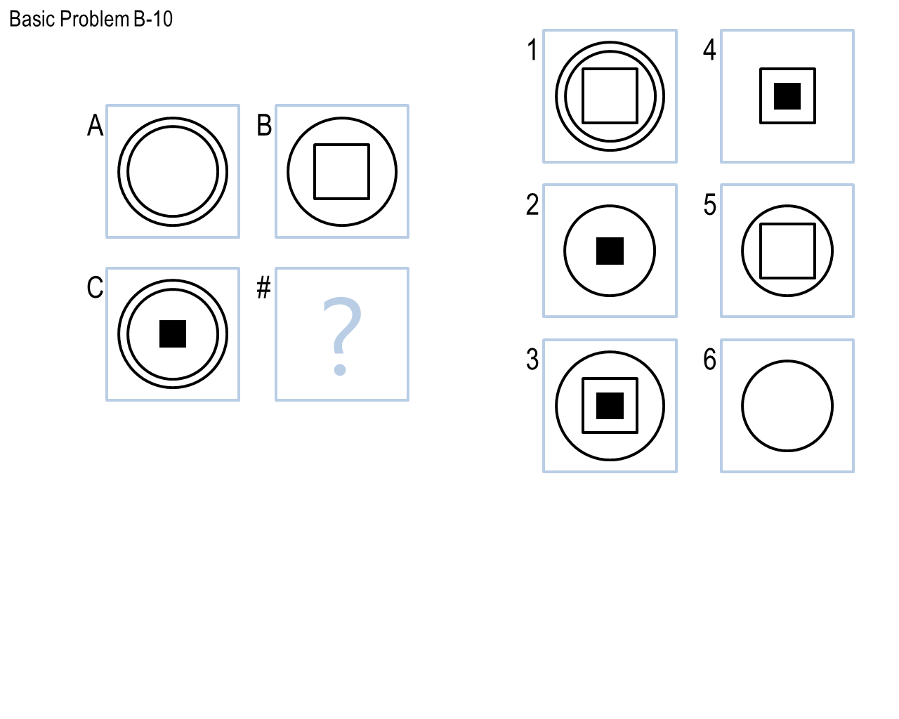
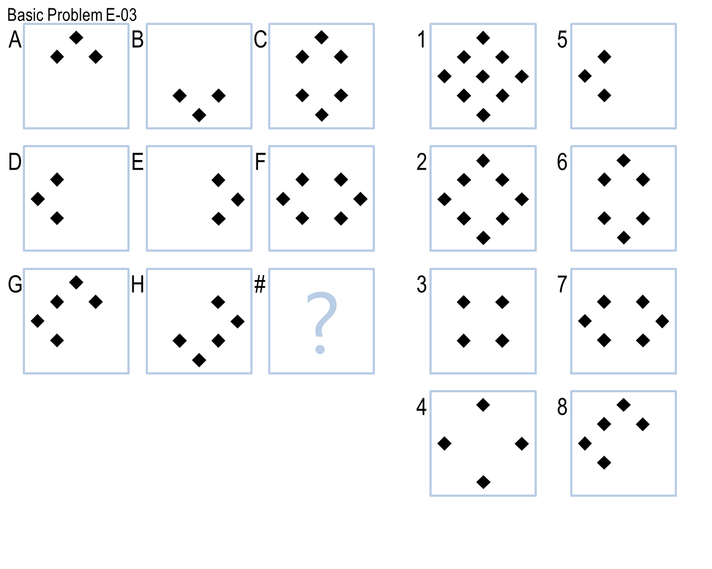
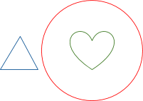
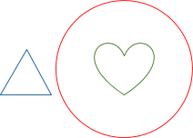
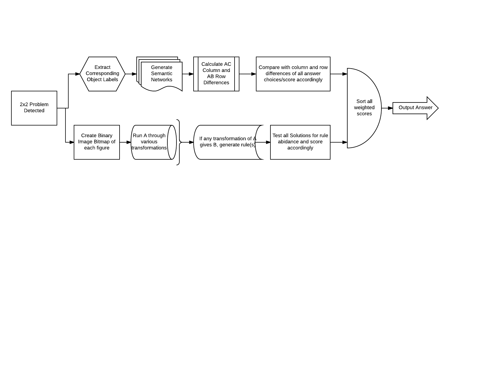
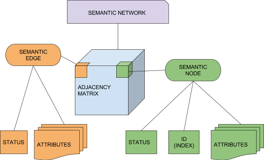

<head>
	<meta content="text/html; charset=UTF-8" http-equiv="content-type">
	<link rel="stylesheet" type="text/css" href="styles.css">
</head>
<body class="c14">
	

		<!-- 

			
				
			
			
				
			
		
 -->
		

			
				
			
		

	

	

		
		Project 1
		
			 
		
		
		Solving 2x2 RPM using Verbal and/or Visual Representations
	

	

		
			
		
	

	

		
		Aayush Kumar
		
			 
		
		
		27th September, 2017
	

	

		
		
	

	<h1 class="c28" id="h.4lqp25cx7kth">
		
		Introduction
	</h1>
	

		
		Before I delve into the technical details, I would just like to say that this project proved to be a labor of love. My overall takeaway is that this test of intelligence is no trivial exercise for a computer as I thought it might have been. I also had a fairly decent misunderstanding of the Agents that solve such problems. I used to be under the assumption that there is very minimal rules and ideas pre-programmed into an agent, and that these things need to be derived intelligently from scratch. However, I have come to understand that rules are the foundation of many of our modern Knowledge Based Artificial Intelligences!
	

	

		
		
	

	

		
		Without further ado, here is a technical approach to solving Raven&#39;s Progressive Matrices:
	

	<ol class="c34 lst-kix_ge7qo3u2btfs-0 start" start="1">
		<li class="c5 c36">
			
			Reasoning Approach
		</li>
		<li class="c5 c36">
			
			Knowledge Representation and Solving Process
		</li>
		<li class="c5 c36">
			
			Design
		</li>
		<li class="c5 c36">
			
			Weaknesses
		</li>
		<li class="c5 c36">
			
			Criteria and Metrics
		</li>
		<li class="c5 c36">
			
			Comparing to Human Cognition
		</li>
	</ol>
	

		
		Please Note: 
		
		The following reflection assumes some prior knowledge of Raven&#39;s Progressive Matrices. As we have discussed the problem itself in earlier papers, I will simply jump straight into the approach that I was able to take. This approach differs from what I initially planned, but I do believe that it performs better in many aspects to my initial design
	

	

		
		
	

	

		
		
	

	

		
		
	

	

		
		
	

	<h1 class="c28" id="h.j10wcnfs65s">
		
		Reasoning App
		
		roach
	</h1>
	<h3 class="c8" id="h.ovawxjoi07ia">
		
		What is your agent&#39;s reasoning approach - visual or verbal? Does your agent need to convert between one or the other?
	</h3>
	

		
		
	

	

		
		My agent utilizes all verbal information provided but also checks for basic image transformations between corresponding figures. If such transformation(s) are found, a heavy weight is applied to the answer choice that analogously replicates those transformation(s). The rest of the intuition is derived from the textual clues within the supplied ProblemData.txt, which also contribute to the final confidence interval of each answer choice.
	

	<h1 class="c28" id="h.o78al2wbelr5">
		
		Knowledge Representation and Solving Process
	</h1>
	<h3 class="c8" id="h.lzr2si3oshbv">
		
		How does your agent represent/store the images efficiently? What is your agent&rsquo;s overall problem-solving process?
	</h3>
	

		
		I grappled with this idea for a while, as I quickly realized that even once I did manage to match objects across figures, simply maintaining dictionaries of the changes made was not exactly scalable and would result in even more chaotic code. After much deliberation, I realized what my desired solving process was first- subtraction. I had begun imagining each figure as a variable of some sort that I could do basic arithmetic on, such that for a 2x2 RPM like the one below:
		
			
		
	

	

		
		C + (B - A) = &nbsp;#
	

	

		
		Or to simplify via reducing the number of arithmetic operations:
	

	

		
		B - A = &nbsp;# - C
	

	

		
		and similarly:
	

	

		
		C - A = &nbsp;# - B
	

	

		
		I had gotten so hooked onto this idea of comparing differences in the context of arithmetic, as it also seemed to be much more accommodating of higher dimensionality RPMs such as the 3x3 problem seen here to the left:
		
			
		
	

	

		
		A + B = C&nbsp;&nbsp;&nbsp;&nbsp;&nbsp;&nbsp;&nbsp;&nbsp;&nbsp;&nbsp;&nbsp;&nbsp;&nbsp;&nbsp;&nbsp;&nbsp;A + D = G
	

	

		
		D + E = F&nbsp;&nbsp;&nbsp;&nbsp;&nbsp;&nbsp;&nbsp;&nbsp;&nbsp;&nbsp;&nbsp;&nbsp;&nbsp;&nbsp;&nbsp;&nbsp;B + E = H
	

	

		
		G + H = #&nbsp;&nbsp;&nbsp;&nbsp;&nbsp;&nbsp;&nbsp;&nbsp;&nbsp;&nbsp;&nbsp;&nbsp;&nbsp;&nbsp;&nbsp;&nbsp;C + F = #
	

	

		
		For the sake of our current project, only implementing the subtraction operator to get the difference between two figures would be sufficient for now. However, I wanted to design my Agent to be robust and easily be able to add various operators as needed. Now the million dollar question became: How do I make the variables of this ridiculous algebraic system?
	

	

		
		I needed to be able to represent each figure as a node of some sort that captured not only the characteristics of the objects within the image, but also the relationships between the objects, all while understanding which pairs of objects between the two figures were being operated on. Keeping track of these object mappings and constantly referencing them any time I wanted to do an operation of a figure was an ugly concept to me, and I believed that my knowledge representation should somehow be able to implicitly characterize which objects correspond to each other. In a sense, I had begun thinking about vector math for my figures. More specifically, as long as my objects are in the correct index of the feature vector, doing math between figures would just become a matter of implementing individual object arithmetic:
	

	
	
	<table class="c44">
		<tbody>
			<tr class="c25">
				<td class="c19" colspan="1" rowspan="1">
					

						
						Figure A feature Vector
					

				</td>
				<td class="c29" colspan="1" rowspan="1">
					

						
						Figure A = [objA, objB, objC]
					

				</td>
			</tr>
			<tr class="c25">
				<td class="c19" colspan="1" rowspan="1">
					

						
						Figure B feature Vector
					

				</td>
				<td class="c19" colspan="1" rowspan="1">
					

						
						Figure B = [objD, objE, objF]
					

				</td>
			</tr>
			<tr class="c25">
				<td class="c19" colspan="1" rowspan="1">
					

						
						Figure Subtraction (aka: element-wise object subtraction)
					

				</td>
				<td class="c19" colspan="1" rowspan="1">
					

						
						B - A
					

				</td>
			</tr>
		</tbody>
	</table>
	

		
		However, this still fails to capture the relationships between objects within the same figure. For that I kept on thinking about the Semantic Network Graphs that we depicted in class, complete with nodes and edges. Several weeks later than I was hoping to have come up with a substantial knowledge representation, I realized that simply combining these two ideas of graphs and vector math would give me exactly what I needed: adjacency matrices that I could do math with.
	

	

		
		After trying out several different designs for the adjacency matrices that incorporated defined columns and rows, I had my first iteration of design for my knowledge representation of a figure:
	

	

		
		Figure A
		
			
		
	

	
	
	<table class="c17">
		<tbody>
			<tr class="c25">
				<td class="c7" colspan="1" rowspan="1">
					

						
						
					

				</td>
				<td class="c7" colspan="1" rowspan="1">
					

						
						objA
						
						1
					

				</td>
				<td class="c7" colspan="1" rowspan="1">
					

						
						objB
						
						1
					

				</td>
				<td class="c7" colspan="1" rowspan="1">
					

						
						objC
						
						1
					

				</td>
			</tr>
			<tr class="c25">
				<td class="c7" colspan="1" rowspan="1">
					

						
						objA
						
						1
					

				</td>
				<td class="c7" colspan="1" rowspan="1">
					

						
						N/A
					

				</td>
				<td class="c7" colspan="1" rowspan="1">
					

						
						(in)
					

				</td>
				<td class="c7" colspan="1" rowspan="1">
					

						
						0
					

				</td>
			</tr>
			<tr class="c25">
				<td class="c7" colspan="1" rowspan="1">
					

						
						objB
						
						1
					

				</td>
				<td class="c7" colspan="1" rowspan="1">
					

						
						0
					

				</td>
				<td class="c7" colspan="1" rowspan="1">
					

						
						N/A
					

				</td>
				<td class="c7" colspan="1" rowspan="1">
					

						
						(left-of)
					

				</td>
			</tr>
			<tr class="c25">
				<td class="c7" colspan="1" rowspan="1">
					

						
						objC
						
						1
					

				</td>
				<td class="c7" colspan="1" rowspan="1">
					

						
						0
					

				</td>
				<td class="c7" colspan="1" rowspan="1">
					

						
						0
					

				</td>
				<td class="c7" colspan="1" rowspan="1">
					

						
						N/A
					

				</td>
			</tr>
		</tbody>
	</table>
	

		
		I decided to use numeric statuses for object deletion and addition in the first row/column. However, object deletion would still prove to be somewhat confusing and messy, as deleting an object would have to be reflected in the column/row header somehow, where 1 translated to a visible object, 0 translated to an invisible object, and -1 translated to the subtraction of a visible object from an invisible object (ie: loss of an object). In addition, doing arithmetic between two figures does not leverage the adjacency matrix indices as much and requires an extra column and row for simply representing each object twice. Although space was not a constraint for the scope of our sample problems, I still felt the urge to optimize this.
	

	

		
		My second iteration turned out much better, as i made use of the diagonal elements in the matrix and stored the objects themselves there without any identifying them by name and simply assigning them to the correct index initially and henceforth using an index to refer to them. This idea, whilst I am sure confusing at first, might become more clear below.
	

	

		
		
	

	

		
			
		
	

	
	
	<table class="c17">
		<tbody>
			<tr class="c25">
				<td class="c7" colspan="1" rowspan="1">
					

						
						obj
						
						1
					

				</td>
				<td class="c7" colspan="1" rowspan="1">
					

						
						(in)
					

				</td>
				<td class="c7" colspan="1" rowspan="1">
					

						
						(left-of)
					

				</td>
			</tr>
			<tr class="c25">
				<td class="c7" colspan="1" rowspan="1">
					

						
						0
					

				</td>
				<td class="c7" colspan="1" rowspan="1">
					

						
						obj
						
						1]
					

				</td>
				<td class="c7" colspan="1" rowspan="1">
					

						
						0
					

				</td>
			</tr>
			<tr class="c25">
				<td class="c7" colspan="1" rowspan="1">
					

						
						0
					

				</td>
				<td class="c7" colspan="1" rowspan="1">
					

						
						0
					

				</td>
				<td class="c7" colspan="1" rowspan="1">
					

						
						obj
						
						1
					

				</td>
			</tr>
		</tbody>
	</table>
	

		
		
	

	

		
		This way, arithmetic of adjacency matrices also becomes significantly easier, as we&#39;ve abstracted away the object labels and the indices represent a sort of numerical id for each object. Better yet, we cut down on the extra column and row as well, resulting in a knowledge representation that is concise yet easily usable to solve RPM&#39;s with.
	

	<h1 class="c28" id="h.1nky02f4epf6">
		
		Design
	</h1>
	<h3 class="c8" id="h.ne5doswx8d61">
		
		Provide an overview of the design of your agent
		
			
		
		
			
		
	<!-- </h3>
	<h1 class="c28" id="h.56f44x7edjwz">
	</h1> -->
	<!-- <h1 class="c12" id="h.43z6dez6t33">
		
            Test
		
	</h1>
	<h1 class="c12" id="h.vnajno2sd0ji">
		
		
	</h1>
	<h1 class="c12" id="h.n3mx3t4po1r4">
		
		
	</h1>
	<h1 class="c12" id="h.ui4wair0mkt">
		
		
	</h1>
	<h1 class="c12" id="h.ffgi2skkgalg">
		
		
	</h1>
	<h1 class="c12" id="h.rqhqvmwyz7t3">
		
		
	</h1>
	<h1 class="c12" id="h.p56iq18pumg2">
		
		
	</h1> -->
	<h1 class="c28" id="h.efoauag8drd5">
		
		Weaknesses
	</h1>
	<h3 class="c8" id="h.i85ws8se9wc5">
		
		What mistakes does your agent makes? Could these mistakes be resolved within your agent&rsquo;s current approach, or are they fundamental problems with the way your agent approaches these problems?
	</h3>
	

		
		One weak point of my agent is most certainly the object matching approach. Currently, I look for the most common matching objects in another figure and greedily assign them to the objects in my current figure. This type of greedy matching does decently well especially in terms of runtime complexity, but it is not as accurate as an optimal matching algorithm that would try to find the best overall matches between the figures. In addition, I currently only match objects from Figure A to Figures B and C, and then match objects in Figures 1, 2, 3, 4, 5, and 6 to that of B and C. Im the future, I would like to derive some sort of matching algorithm that isn&#39;t chaining matches together one at a time like my current Agent does. Instead, it would be ideal to pass in multiple figures and extract matches from that. This would also remedy the issue of an object from figure A disappearing in figures B and C, as considering an answer choice between 1 and 6 that contains this object would confuse my current algorithm into thinking this is a whole new object entirely, instead of matching it to that of A.
	

	

		
		
	

	<h1 class="c9" id="h.tuokeblvw1po">
		
		Criteria and Metrics
	</h1>
	<h3 class="c9" id="h.2xr5eqbqj1u">
		
		Please detail on your evaluation/performance criterias and your agent&#39;s results. Think about accuracy, efficiency and generality. Are there other metrics or scenarios under which you think your agent&#39;s performance would improve or suffer?
	</h3>
	

		
		My agent seems to do fairly well dare I say with the 2x2 Raven&#39;s Progressive Matrices problems, as the representation and approach to the problem pose several strengths. For one, as I mentioned earlier, my agent is able to consistently pick up on object transformations and then apply those very same transformations to corresponding objects quite easily. In the future, if more unique transformations have to be accounted for, the structure of my Agent enables very little modification needed to accommodate new situations. In addition, I am able to ensure that each semantic network is represented in a decently sized numpy array which collectively take up storage of O(9n^2) or O(n^2), with n being the largest number of objects found in a single figure. This concise representation ensures a fairly speedy runtime of my algorithm and thus makes it quite performant. Where my agent lacks is in situations where no textual information is provided and the transformations between figures is different for each object. In such a case, I would have to take some time to implement a visual recognition system to label the objects individually and somehow characterize them to generate Semantic Nodes and Edges. In addition, the problem space and ontology become much larger when we break free of the ProblemData.txt files, so perhaps I would have to explore other better approaches. Another weakness of my algorithm is that the confidence intervals i generate using the simple Ratio Test aren&#39;t, well, very confident:
	

	

		
		Basic Problems B
	

	
	
	<table class="c17">
		<tbody>
			<tr class="c25">
				<td class="c1" colspan="1" rowspan="1">
					

						
						1
					

				</td>
				<td class="c1" colspan="1" rowspan="1">
					

						
						2
					

				</td>
				<td class="c1" colspan="1" rowspan="1">
					

						
						3
					

				</td>
				<td class="c1" colspan="1" rowspan="1">
					

						
						4
					

				</td>
				<td class="c1" colspan="1" rowspan="1">
					

						
						5
					

				</td>
				<td class="c1" colspan="1" rowspan="1">
					

						
						6
					

				</td>
				<td class="c1" colspan="1" rowspan="1">
					

						
						7
					

				</td>
				<td class="c1" colspan="1" rowspan="1">
					

						
						8
					

				</td>
				<td class="c1" colspan="1" rowspan="1">
					

						
						9
					

				</td>
				<td class="c1" colspan="1" rowspan="1">
					

						
						10
					

				</td>
				<td class="c1" colspan="1" rowspan="1">
					

						
						11
					

				</td>
				<td class="c1" colspan="1" rowspan="1">
					

						
						12
					

				</td>
			</tr>
			<tr class="c25">
				<td class="c1" colspan="1" rowspan="1">
					

						
						36.6%
					

				</td>
				<td class="c1" colspan="1" rowspan="1">
					

						
						29.5%
					

				</td>
				<td class="c1" colspan="1" rowspan="1">
					

						
						34.5%
					

				</td>
				<td class="c1" colspan="1" rowspan="1">
					

						
						30.1%
					

				</td>
				<td class="c1" colspan="1" rowspan="1">
					

						
						23.9%
					

				</td>
				<td class="c1" colspan="1" rowspan="1">
					

						
						6.7%
					

				</td>
				<td class="c1" colspan="1" rowspan="1">
					

						
						17.7%
					

				</td>
				<td class="c1" colspan="1" rowspan="1">
					

						
						25.4%
					

				</td>
				<td class="c1" colspan="1" rowspan="1">
					

						
						9.6%
					

				</td>
				<td class="c1" colspan="1" rowspan="1">
					

						
						19.6%
					

				</td>
				<td class="c1" colspan="1" rowspan="1">
					

						
						22.4%
					

				</td>
				<td class="c1" colspan="1" rowspan="1">
					

						
						17.3%
					

				</td>
			</tr>
		</tbody>
	</table>
	

		
		Although I could continue adjusting my weights, I sincerely believe that there is another better way to gauge confidence in my answer besides comparing the top two scores in the end. Perhaps along the way, I could give some sort of indication as whether or not I believe the answer I will derive is actually likely to be valid or not. One thing I have realized is that the success of my Agent largely depends on the initial object matching process, so that would potentially be a good candidate method to insert something like this into.
	

	<h1 class="c28" id="h.a7ftml3oon3v">
		
		Comparing to Human Cognition
	</h1>
	<h3 class="c8" id="h.dwxpb09usy14">
		
		What does the design and performance of your agent tell us about human cognition? How is it similar, and how is it different? Has your agent&rsquo;s performance given you any insights into the way people solve these problems?
	</h3>
	

		
		In designing and building my agent, I realized that the approach I took very closely modeled some aspects of human behavior. The idea of breaking down a problem into very small components is one that we are taught very frequently, and is a notion that massively helps the accuracy of the semantic networks. Without segmented objects, it would be difficult to understand many of the relations and patterns! This segways into another aspect of human cognition and learning, we tend to implicitly use what we believe to be true based off some sort of prior evidence to justify rules/patterns that can be applied to solve a host of different problems.
	

	

		
		
	

	

		

			
				
			
		

	

</body>
